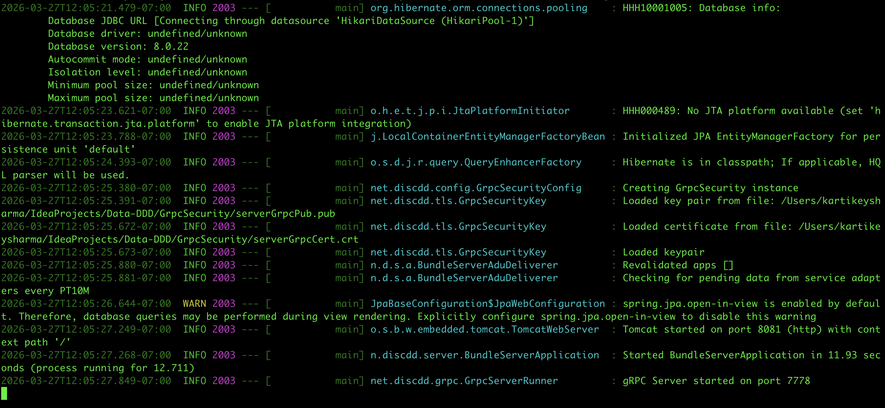
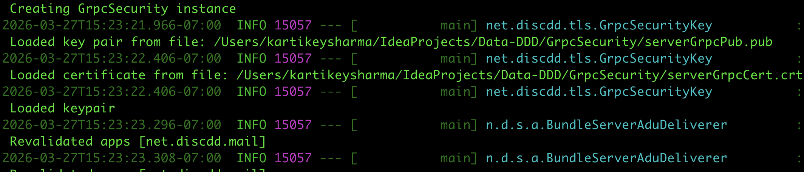
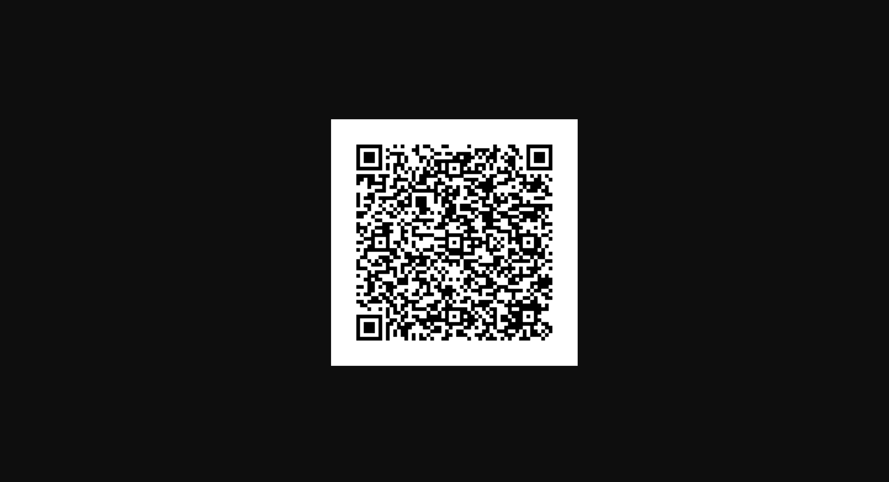
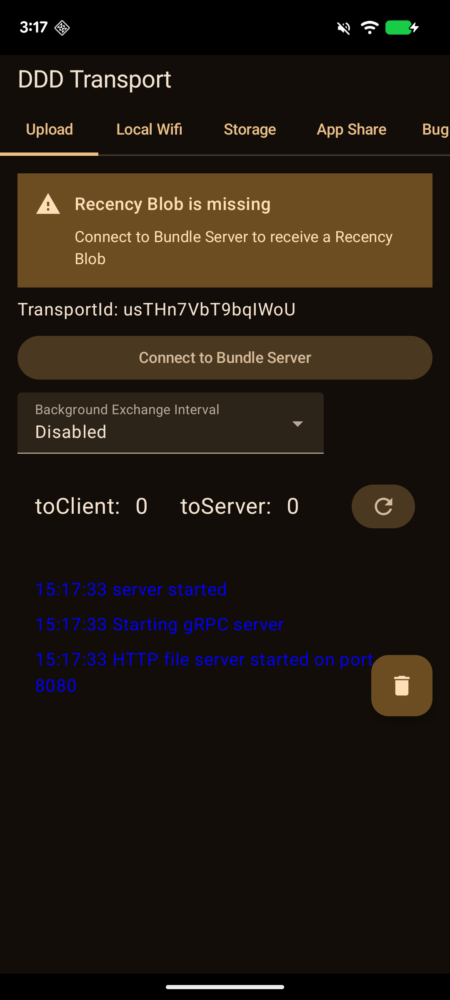
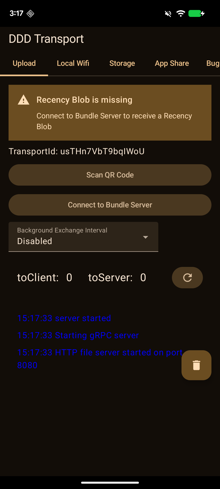
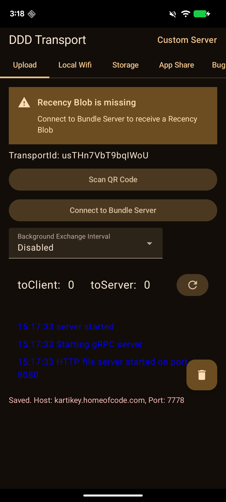
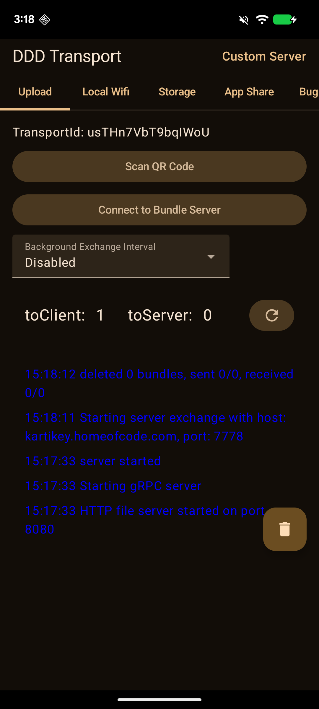
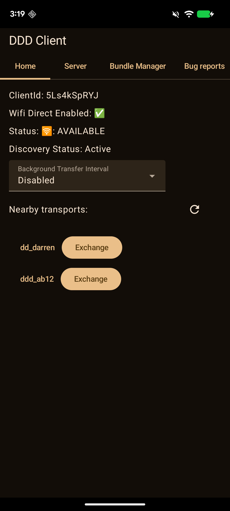
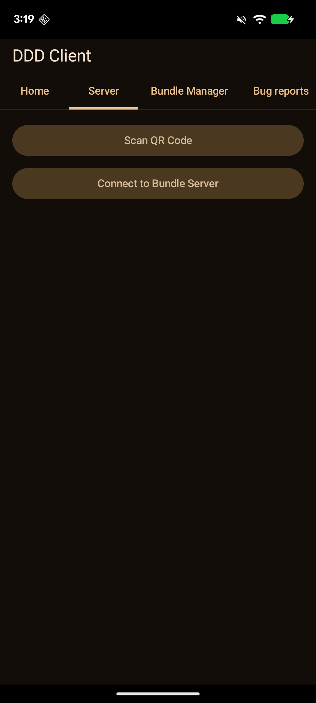
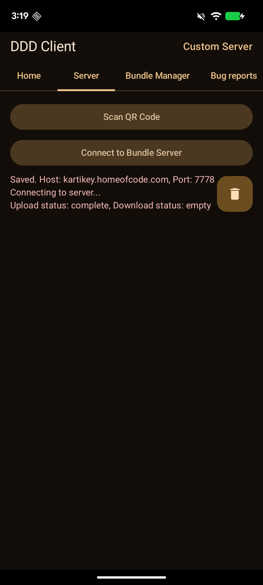

# DDD Server Deployment & QR Code Configuration Guide

This guide walks you through deploying your own DDD BundleServer and configuring the BundleClient and BundleTransport Android apps to connect to it using QR code scanning.

 

## 1. Prerequisites

- **Java 21** or later
- **MySQL 8.x**
- **Maven** (or IntelliJ IDEA with bundled Maven)
- A server with a **public IP or hostname** (for production deployment)
- Android devices running **API 33+** (Android 13+) for the client/transport apps

 

## 2. Server Setup

### 2.1 Clone the Repository

         
    git clone https://github.com/SJSU-CS-systems-group/DDD.git    
    cd DDD    
         

 

### 2.2 Configure Maven for GitHub Packages

Create or edit ~/.m2/settings.xml:

 

         
    <settings xmlns="http://maven.apache.org/SETTINGS/1.0.0"    
      xmlns:xsi="http://www.w3.org/2001/XMLSchema-instance"    
      xsi:schemaLocation="http://maven.apache.org/SETTINGS/1.0.0    
                          http://maven.apache.org/xsd/settings-1.0.0.xsd">    
    <servers>    
      <server>    
        <id>github</id>    
        <username>YOUR_GITHUB_USERNAME</username>    
        <password>YOUR_GITHUB_PERSONAL_ACCESS_TOKEN</password>    
      </server>    
    </servers>    
    </settings>    
         

 

### 2.3 Build the Project

         
    mvn install -DskipTests    
         

 

This builds all modules including bundle-core, bundleserver, and serviceadapter-core.

 

### 2.4 Create the MySQL Database

         
    mysql -u root -p -e "CREATE DATABASE dtn_server_db;"    
         

 

### 2.5 Set Up the Data Directory

Create a root directory for the server's data storage:

 

         
    mkdir -p /path/to/your/data-dir/    
         

 

The server will automatically create subdirectories (BundleSecurity/, BundleTransmission/, Shared/, etc.) on first startup.

 

### 2.6 Generate Server Keys

The server needs three public/private key pairs for bundle security. These are generated automatically on first startup and stored in:

 

         
    /path/to/your/data-dir/BundleSecurity/Keys/Server/Server_Keys/    
         

 

The public key files are:

- server_identity.pub
- server_signed_pre.pub
- server_ratchet.pub

 

These are the keys that will be encoded in the QR code for client configuration.

 

### 2.7 Create the Server Properties File

Create a properties file (e.g., bundleserver.properties):

 

         
    spring.datasource.username=root    
    spring.datasource.password=YOUR_MYSQL_PASSWORD    
    bundle-server.bundle-store-root=/path/to/your/data-dir/    
         

 

**Important:** The `bundle-store-root` path must end with `/`.

 

### 2.8 Start the BundleServer

         
    java -jar bundleserver/target/bundleserver-0.0.1-SNAPSHOT.jar /path/to/bundleserver.properties    
         

 

You should see:

         
    Tomcat started on port 8081 (http)    
    gRPC Server started on port 7778    

 

## 3. Mail Adapter Setup (Optional)

If you want email functionality via the DDD mail app, you need to deploy the K9 mail adapter alongside the bundleserver.

 

### 3.1 Create the K9 Adapter Database

         
    mysql -u root -p -e "CREATE DATABASE k9_adapter;"    
         

 

### 3.2 Register the Mail Adapter in the BundleServer Database

         
    mysql -u root -p -e "INSERT INTO dtn_server_db.registered_app_adapter (app_id, address) VALUES ('net.discdd.mail', 'localhost:9091');"    
         

 

### 3.3 Create the K9 Adapter Properties File

Create k9-adapter.properties:

 

         
    spring.datasource.username=root    
    spring.datasource.password=YOUR_MYSQL_PASSWORD    
    adapter-server.rootdir=/path/to/your/data-dir    
    smtp.relay.host=localhost    
    smtp.relay.port=25    
    smtp.localDomain=localhost    
    smtp.localPort=2525    
         

 

### 3.4 Build the K9 Adapter

         
    mvn package -pl apps/k9/server -am -DskipTests    
         

 

### 3.5 Start the Services (Order Matters!)

1. **Start the BundleServer first:**java -jar bundleserver/target/bundleserver-0.0.1-SNAPSHOT.jar /path/to/bundleserver.properties

2. **Then start the K9 adapter:**java -jar apps/k9/server/target/k9-0.0.1-SNAPSHOT.jar /path/to/k9-adapter.properties

 

Verify the bundleserver logs show:

         
    Revalidated apps [net.discdd.mail]    
         

## 4. QR Code Endpoint

Once the bundleserver is running, it automatically serves a QR code at:

 

         
    http://<your-server-hostname>:8081/qr    
         

 

This QR code encodes a URL containing:

- The server's hostname (derived from the HTTP request)
- The gRPC port (default: 7778)
- The three server public keys (URL-safe Base64 encoded)

 

Open this URL in a browser to view the QR code.

 

## 5. Configuring BundleTransport via QR Code

The BundleTransport app carries data between disconnected clients and the server. It only needs the server's host and port (not the public keys).

### Steps:

1. Open the **BundleTransport** app on your Android device.

2. **Activate the Easter Egg** to reveal the QR scanner: On the Upload tab, find the **"toClient:"** label in the message counts row. **Tap it 7 times within 3 seconds.** You will see a toast message: "Easter Egg Toggled!"

3. The **"Scan QR Code"** button will now appear above "Connect to Bundle Server". Tap it.

4. Grant camera permission when prompted.

5. Point the camera at the QR code displayed at http://<your-server>:8081/qr.

6. Once scanned, the app will display a confirmation message: `Saved. Host: <hostname>, Port: <port>`

7. The app header will now show **"Custom Server"** on the right side, indicating a non-default server is configured.

8. Tap **"Connect to Bundle Server"** to verify the connection.

## 6. Configuring BundleClient via QR Code

The BundleClient app is the end-user client. It needs the server's host, port, AND public keys for secure bundle encryption.

### Steps:

1. Open the **BundleClient** app on your Android device.

2. **Activate the Easter Egg** to reveal the QR scanner: Navigate to the **Home** tab and find the **"WiFi Direct"** section. **Tap the WiFi Direct status area 7 times within 3 seconds.** You will see a toast message: "Easter Egg Toggled!"

3. Navigate to the **Server** tab. The **"Scan QR Code"** button will now appear above "Connect to Bundle Server". Tap it.

4. Grant camera permission when prompted.

5. Point the camera at the QR code displayed at http://<your-server>:8081/qr.

6. Once scanned, the app will display a confirmation message: `Saved. Host: <hostname>, Port: <port>`. The three server public keys are also configured automatically in the background.

7. The app header will now show **"Custom Server"** on the right side, indicating a non-default server is configured.

8. Tap **"Connect to Bundle Server"** to verify the connection.

- **First connection:** You will see `Upload status: complete, Download status: empty` — this is expected as the server is registering the new client.
- **Second connection onward:** Full bundle exchange will occur.

  

## 7. QR Code URL Format Reference

The QR code encodes a URL in the following format:

 

         
    https://discdd.net/srvr?host=HOST&port=PORT&identity=KEY&signedpre=KEY&ratchet=KEY    
         

 

**Parameter**

**Description**

host

Server hostname or IP address

port

gRPC port (default: 7778)

identity

Server identity public key (URL-safe Base64)

signedpre

Server signed pre-key (URL-safe Base64)

ratchet

Server ratchet public key (URL-safe Base64)

 

The keys are extracted from the PEM files in the server's BundleSecurity/Keys/Server/Server_Keys/ directory.

 

## 8. Troubleshooting

### "No service adapter for net.discdd.mail"

- The K9 mail adapter is not running or not registered.
- Verify the adapter is running on port 9091.
- Check the registered_app_adapter table: SELECT * FROM dtn_server_db.registered_app_adapter;

 

### "Could not produce a path for ..." (first connection only)

- This is **expected** on the first connection from a new client. The server generates a fresh bundle for the client, but the client initially requested a stale bundle ID. The second connection will work normally.

 

### QR scan shows no result

- Ensure the QR code URL is well-formed by scanning with a generic QR scanner app first.
- Verify the server's public key files exist in BundleSecurity/Keys/Server/Server_Keys/.

 

### Client can't connect after scanning QR

- Ensure the server hostname in the QR code is reachable from the Android device's network.
- Check that port 7778 (gRPC) is open on the server's firewall.
- If switching from one server to another, you may need to clear the app's data (Settings > Apps > BundleClient > Clear Data) to reset stale bundle state.

 

### K9 adapter fails to start with "Could not resolve placeholder"

- Ensure all required properties are set in the K9 properties file:adapter-server.rootdir
- smtp.relay.host
- smtp.relay.port
- smtp.localDomain
- smtp.localPort
